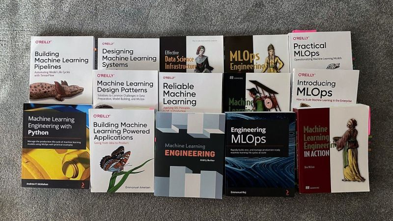

# MLOps Books

* [My MLOps bookshelf by Antonio Feregrino](https://medium.com/softwareydata/my-mlops-bookshelf-c27f6e29370d):MLOps book recommendation with providing his personal reviews of the MLOps books, which he already read. 

* [Designing Machine Learning Systems, Chip Huyen](https://www.oreilly.com/library/view/designing-machine-learning/9781098107956/): Why does 9/10 models never make it to production? Read this book and compare to how ML is done at most companies, then you know… Highly recommended!

* [Machine Learning Engineering by Andriy Burkov](http://www.mlebook.com/wiki/doku.php?id=start): This book is available as a read-first-buy-later principle.

* [𝗕𝘂𝗶𝗹𝗱𝗶𝗻𝗴 𝗠𝗮𝗰𝗵𝗶𝗻𝗲 𝗟𝗲𝗮𝗿𝗻𝗶𝗻𝗴 𝗣𝗶𝗽𝗲𝗹𝗶𝗻𝗲𝘀, Hannes Hapke & Catherine Nelson](https://www.oreilly.com/library/view/building-machine-learning/9781492053187/?_gl=1*1rzym6j*_ga*MTM4OTgzMTk4MC4xNjczMjEzNzY2*_ga_092EL089CH*MTY3MzQ2NjIyMi4yLjEuMTY3MzQ3MDk0Ni4yOS4wLjA): I bought this book specifically for the chapters on TensorFlow Serving, well worth it! Other chapters are however also interesting to get some insights to the TFX ecosystem.

* [Deep Learning in Production](https://www.amazon.com/gp/product/6180033773/ref=as_li_tl?ie=UTF8&tag=aisummer-20&camp=1789&creative=9325&linkCode=as2&creativeASIN=6180033773&linkId=fb7484e19fc03923fa2ec3012e5629cd): Build, train, deploy, scale and maintain deep learning models. Understand ML infrastructure and MLOps using hands-on examples.

* [𝐁𝐞𝐠𝐢𝐧𝐧𝐢𝐧𝐠 𝐌𝐋𝐎𝐩𝐬 𝐰𝐢𝐭𝐡 𝐌𝐋𝐅𝐥𝐨𝐰](https://lnkd.in/dgiKNgfX): This book guides you through the process of integrating MLOps principles into existing or future projects using MLFlow, operationalizing your models, and deploying them in AWS SageMaker, Google Cloud, and Microsoft Azure.

* [MLOps Engineering at Scale, Carl Osipov](https://www.oreilly.com/library/view/mlops-engineering-at/9781617297762/): This book teaches you how to implement efficient machine learning systems using pre-built services from AWS and other cloud vendors. This easy-to-follow book guides you step-by-step as you set up your serverless ML infrastructure, even if you’ve never used a cloud platform before.
 
* [𝗠𝗮𝗰𝗵𝗶𝗻𝗲 𝗟𝗲𝗮𝗿𝗻𝗶𝗻𝗴 𝗗𝗲𝘀𝗶𝗴𝗻 𝗣𝗮𝘁𝘁𝗲𝗿𝗻𝘀, Valliappa Lakshmanan, Sara Robinson, Michael Munn](https://www.oreilly.com/library/view/machine-learning-design/9781098115777/): An excellent introduction to ML modeling and feature representation for all kinds on different data modalities. I regularly use it as inspiration for data preprocessing and feature engineering.
 
* [Practical Deep Learning at Scale with MLflow, Yong Liu, Dr. Matei Zaharia](https://www.oreilly.com/library/view/practical-deep-learning/9781803241333/): This book focuses on deep learning models and MLflow to develop practical business AI solutions at scale. It also ship deep learning pipelines from experimentation to production with provenance tracking.
 
* [Practical MLOps, Noah Gift & Alfredo Deza](https://www.oreilly.com/library/view/practical-mlops/9781098103002/): The perfect high-level overview of MLOps, buy this book if you do not know where to start or what you want to read about.
 
* 𝗘𝗻𝗴𝗶𝗻𝗲𝗲𝗿𝗶𝗻𝗴 𝗠𝗟𝗢𝗽𝘀, Emmanuel Raj: I can’t put my finger on what this book is about, but there are a lot of golden nuggets on project architecture and software engineering aspects that are needed to create a nice and agile ML lifecycle.
 
* 𝗘𝗳𝗳𝗲𝗰𝘁𝗶𝘃𝗲 𝗗𝗮𝘁𝗮 𝗦𝗰𝗶𝗲𝗻𝗰𝗲 𝗜𝗻𝗳𝗿𝗮𝘀𝘁𝗿𝘂𝗰𝘁𝘂𝗿𝗲, Ville Tuulos: Very nice and easy read suitable for the late nights when sleeping is impossible. Explains the reasoning behind the ML pipelines architectures and is worth reading regardless of if you are interested in Metaflow or not.
 
* 𝗗𝗮𝘁𝗮 𝗦𝗰𝗶𝗲𝗻𝗰𝗲 𝗼𝗻 𝗔𝗪𝗦, Chris Fregly & Antje Barth: Some parts of the book are very nice but some parts feel like it is only code blocks stacked onto code blocks with no explanation of the ”why”. I use it as inspiration on how to use the AWS APIs.
 
* 𝗟𝗲𝗮𝗿𝗻 𝗔𝗺𝗮𝘇𝗼𝗻 𝗦𝗮𝗴𝗲𝗠𝗮𝗸𝗲𝗿, Julien SIMON: Haven’t gotten to finish this one yet, it will keep me occupied for some more weeks. Well written and much better of explaining why things are done in a specific way and what options there are.